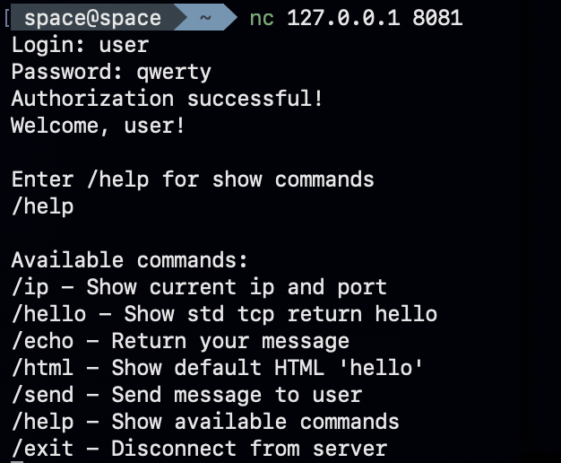

## TCP Server (C++)

Simple TCP / HTTP server written in C++ using low-level Linux sockets.



## 🚀 Features

• Two servers in one program.

• HTTP server on port `8080`.

• Chat server on port `8081`.

• Chat authorization.

• Chat commands:
`/help`
`/ip`
`/hello`
`/echo`
`/html`
`/send`
`/exit`

• HTTP login page.

• HTTP menu page after successful login.

• HTTP routes:
`/`
`/menu`
`/hello`
`/about`

• HTML pages loaded from `src/html_pages/`.

• 404 page for unknown routes.


## ⚙️ Requirements

• Linux / macOS.

• g++ compiler.

• make.


## 🔑 Test users

• `admin / admin`

• `user / qwerty`

• `test / 123`


## 💡 Build and Run

Go to `src`:

```bash
cd src
```

Build:

```bash
make
```

Run:

```bash
make run
```


## 🌐 HTTP

Open in browser:

```text
http://127.0.0.1:8080/
```

## 💬 Chat

Connect from terminal:

```bash
nc 127.0.0.1 8081
```

Then enter login and password.

